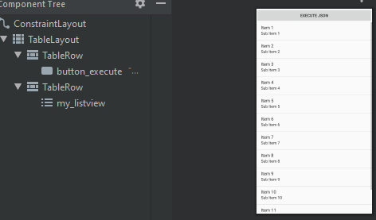
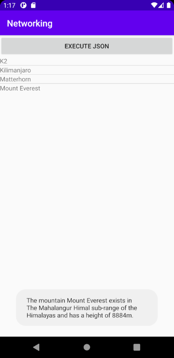

# Rapport

**Skriv din rapport här!**


##### 1 - Listview

I added a listview which I would later fill with stuff!




##### 2 - ArrayList & ArrayAdapter

Afterwards I added an arraylist and arrayadapter which were connected to both my listview and my second class, Mountain.

```
public class MainActivity extends AppCompatActivity {

    private ArrayList<Mountain> mountainArrayList = new ArrayList<>();
    private ArrayAdapter<Mountain> mountainArrayAdapter;

        protected void onCreate(Bundle savedInstanceState) {


        mountainArrayList = new ArrayList<>();
        mountainArrayAdapter = new ArrayAdapter<>(this, R.layout.layout_list_mountains,R.id.layouttextview , mountainArrayList);

        ListView thelistview = (ListView) findViewById(R.id.my_listview);
        thelistview.setAdapter(mountainArrayAdapter);
        }
}
```

With this particular aspect I had a lot of issues. This was primarily caused by a confusion of how I were to retrieve a specific value from the Mountain Class.
I had missed the part where I had to @Override the toString functionality in Mountain and return a value. I had attempted to return values with functions but I had been unsuccessful in my attempts until I found that particular section of an older instruction.

```
        @Override
        public String toString(){
                return mountainName;
        }
```


##### 3 - JSON Task

I'll be excluding the network code as it's handed to us.

The onPostExecute part added every mountain to the Mountain class per 'for loop'. 

```

for (int i=0; i < jsonArray.length(); i++) // Goes through i in array based on array length.
                {
                    JSONObject oneObject = jsonArray.getJSONObject(i); //Assigns object to variable based on current object in the array jsonArray.
                            String name = oneObject.getString("name");
                            String location = oneObject.getString("location");
                            Integer height = oneObject.getInt("size");
                    mountainArrayList.add(new Mountain(name, location, height)); //Adds a new mountain in arraylist with name, location and height (int) values.

                }
```

Previously I added every value from the JSON parse to the Mountain class but as I ran into some trouble with getting values from Mountain into the list, I started to reduce the variety of values to minimize potential issues.

After the values has been parsed, the list is updated through the following line of code:

```
                mountainArrayAdapter.notifyDataSetChanged();
```

##### 4 - Results

And here are the results, with toast message included, implemented through a listener.

```

        thelistview.setOnItemClickListener(new AdapterView.OnItemClickListener(){
            @Override
            public void onItemClick(AdapterView<?> parent, View view, int position, long id){
                String name = mountainArrayList.get(position).getmountain("name");
                String height = mountainArrayList.get(position).getmountain("height");
                String location = mountainArrayList.get(position).getmountain("location");
                String message = "The mountain " +  name + " exists in " + location + " and has a height of " + height + "m.";
                Toast.makeText(MainActivity.this, message, Toast.LENGTH_SHORT).show();
            }
        });

```


